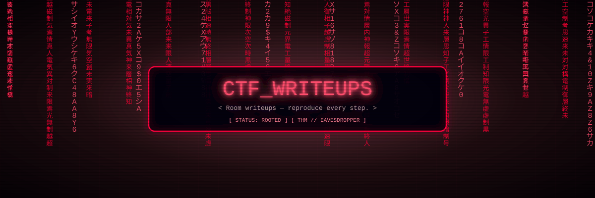

<div align="center">
  
</div>

# CTF Writeups

Personal writeups for CTF rooms. Raw notes taken during solves — follow along
step by step to reproduce.

## Index

| Platform | Room | Path | Technique |
|---|---|---|---|
| TryHackMe | Eavesdropper | `THM/EAVESDROPER` | SSH key login → spot password-harvesting watcher → fake-`sudo` PATH hijack → root |

### THM — Eavesdropper (summary)

1. `nmap`: only port 22 (SSH) open.
2. SSH in as `frank` with the room-provided `id_rsa` key.
3. `ps aux` reveals an attacker process polling `pidof sudo` and teeing
   `/proc/<pid>/fd/0` — someone is harvesting typed sudo passwords.
4. Plant a fake `~/bin/sudo` that logs the typed password to `pass.txt`,
   prepend `~/bin` to `PATH` via `.bashrc`.
5. Read back the captured password, `sudo bash` → root.

## Adding a writeup

New file per room: `<PLATFORM>/<ROOMNAME>` (plain text or markdown).
Suggested shape:

```
<room> writeup

info of target:
ip / creds / provided files

1- recon (nmap, gobuster, ...)
2- foothold (how you got in)
3- enumeration (what you found inside)
4- privilege escalation (exact commands)
5- flags / root proof
```

Redact passwords/secrets (`{REDACTED}`) before committing.
